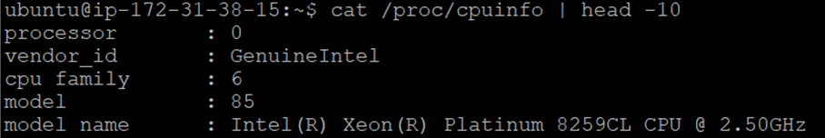
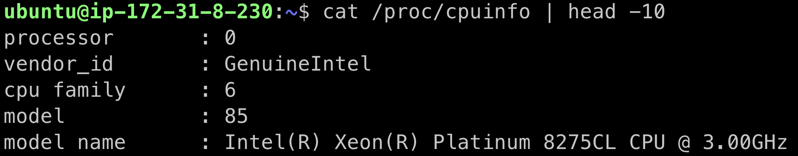
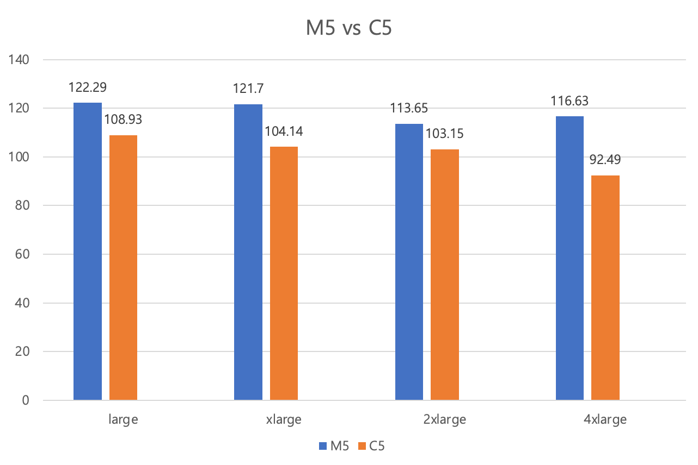

## 📚 M5 Family

### 기능:
- M5 인스턴스는 일반 목적 인스턴스로, 다양한 워크로드를 지원할 수 있는 균형 잡힌 성능 제공
- CPU, 메모리, 네트워크 성능이 적절히 균형을 이루고 있어 웹 서버, 앱 서버, 데이터베이스 등 일반적 애플리케이션에 적합

### CPU
- Amazon EC2 M5 인스턴스는 인텔 제온® 플래티넘 8259CL CPU @ 2.50GHz 프로세서로 구동되는 최신 세대 범용 인스턴스



<br>

## 📚 C5 Family

### 기능:
- 컴퓨팅 최적화를 중점으로 한 인스턴스
- CPU 연산에 더 많은 리소스를 할당하고 CPU 성능이 뛰어남
- 고성능 컴퓨팅, 컴파일 작업, 웹 서버 등의 작업을 수행할 때 더 효과적

### CPU:
- Amazon EC2 C5 인스턴스는 인텔 제온® 플래티넘 8275CL CPU @ 3.00GHz 프로세서
- 컴퓨팅 집약적 워크로드에 최적화되었으며 컴퓨팅 비율당 저렴한 가격으로 비용 효율적이며 뛰어난 성능을 제공함



<br>

## 📚 환경 구성
- Ubuntu Server 24.04 LTS (HVM)
- x86 (64bit)

## 📚 M5

| 인스턴스 크기 | vCPU | 메모리(GiB) | 인스턴스 스토리지(GB) |네트워크 대역폭(Gbps)** | 시간 당 요금 | CPU 아키텍처 |
|---|---|---|---|---|---|---|
|m5.large|2|8|EBS 전용|최대 10|USD 0.118| x86(64bit) |
|m5.xlarge|4|16|EBS 전용|최대 10|USD 0.236| x86(64bit) |
|m5.2xlarge|8|32|EBS 전용|최대 10|USD 0.472| x86(64bit) |
|m5.4xlarge|16|64|EBS 전용|최대 10|USD 0.944| x86(64bit) |


## 📚 C5
| 인스턴스 크기 | vCPU | 메모리(GiB) | 인스턴스 스토리지(GB) |네트워크 대역폭(Gbps)** | 시간 당 요금 | CPU 아키텍처 |
|---|---|---|---|---|---|---|
|c5.large|2|4|EBS 전용|최대 10|USD 0.096| x86(64bit) |
|c5.xlarge|4|8|EBS 전용|최대 10|USD 0.192| x86(64bit) |
|c5.2xlarge|8|16|EBS 전용|최대 10|USD 0.384| x86(64bit) |
|c5.4xlarge|16|32|EBS 전용|최대 10|USD 0.768| x86(64bit) |


## 1️⃣ CPU 연산 처리 속도 측정
- 행렬 연산 코드
```python
import numpy as np
import time

def matrix_multiplication(size):
    A = np.random.rand(size, size)
    B = np.random.rand(size, size)
    start_time = time.time()
    np.dot(A, B)
    end_time = time.time()
    return end_time - start_time

size = 5000  # 행렬 크기
execution_time = matrix_multiplication(size)
print(f"Matrix multiplication time: {execution_time} seconds")
```
<br>

- M5 vs C5



#### 🤔 문제점
- 행렬 연산 작업 코드가 코어를 여러 개를 사용하도록 하는 방식이 아니여서 같은 인스턴스 패밀리 내에서 비교한 결과가 유의미하다고 할 수 없음

#### 🤔 결론
- CPU 연산 처리 속도: `M5` < `C5`
- 행렬 연산 작업 속도 비교 결과, C5 인스턴스는 M5 인스턴스에 비해 행렬 연산에서 전반적으로 더 빠른 성능을 보임
- C5 인스턴스는 높은 CPU 성능을 제공하기 때문에 복잡한 연산 작업에서 더 좋은 성능을 발휘하는 것으로 보임
- 단순한 CPU 연산 처리 속도시간을 C5 인스턴스가 M5 인스턴스 보다 `13.30%` 정도 시간을 줄일 수 있음

#### 🤔 시행착오
- 생각했을 때, M5.4xlarge가 M5.2xlarge 보다 속도가 빨라야하지만, 직접 실행을 시켜봤을 때는 M5.2xlarge의 속도가 빨랐음을 확인할 수 있음
- 첫번째 추측은 코드가 코어를 여러 개를 사용하는 코드가 아니라, 한 개의 코어 만을 사용하여 연산하였기 때문에 속도가 코어 수와는 별개라고 판단하였음
- M5.4xlarge 5대를 새로 생성하여 10번을 반복해서 돌려보았지만 결과는 비슷했음
- 두번째 추측은 하드웨어마다 노후화된 정도가 다르고 다른 가상환경과 자원을 공유하기 때문에 영향을 받아서 그런 것이라고 판단하였음