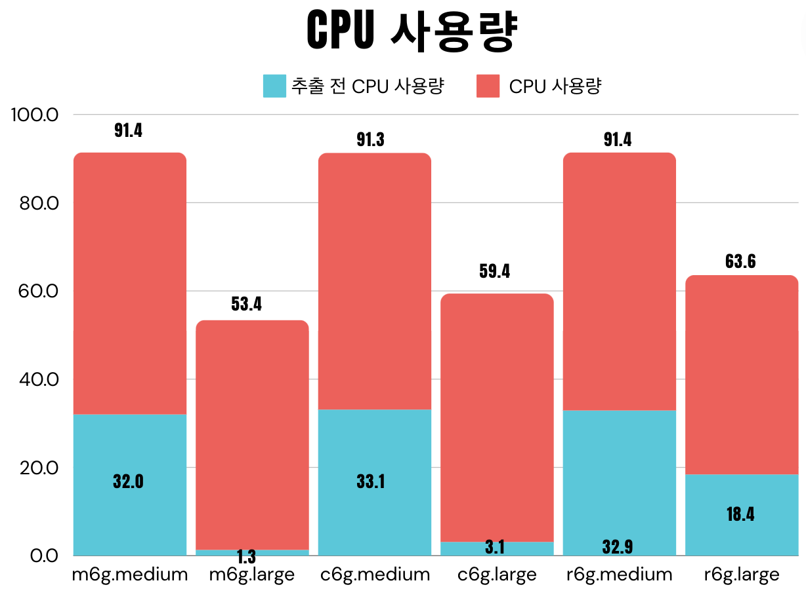
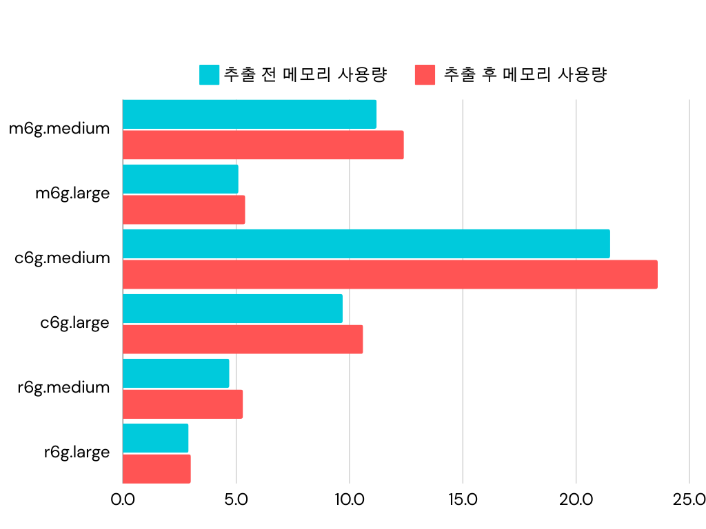
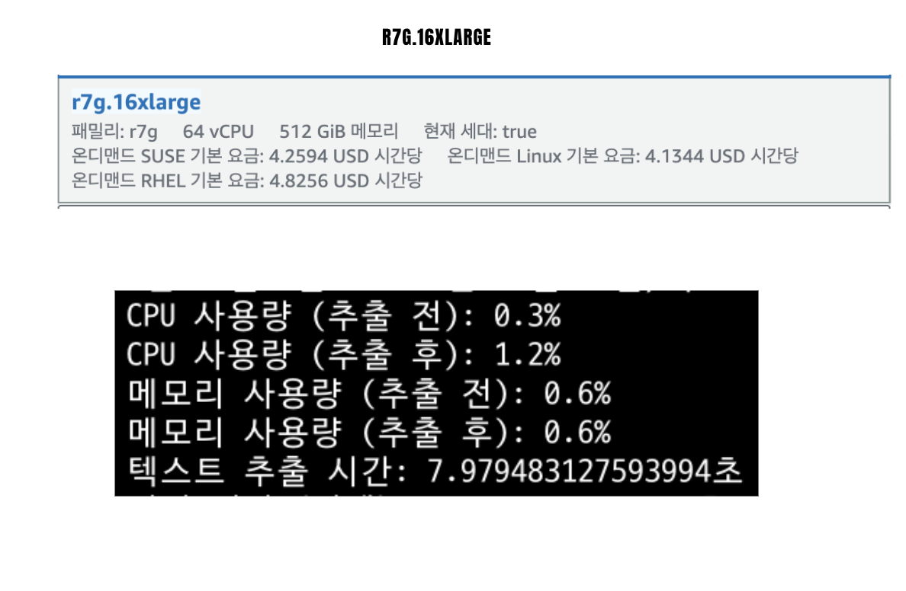

###  테스트 환경
- Ubuntu 24.04 LTS
- 64비트(ARM)

## 1. 개요
이미지 파일에서 텍스트를 추출하는 작업 중에 시스템 자원(CPU 및 메모리)의 사용량 변화를 관찰하고, 작업에 소요된 시간을 측정합니다.

범용(GPU) -> m 인스턴스
컴퓨팅 최적화(Compute Optimized) -> c 인스턴스
메모리 최적화(Memory Optimized) -> r 인스턴스

#### 과정
1. pytesseract를 사용하여 이미지에서 한국어 텍스트를 추출합니다.

2. 텍스트 추출 작업의 추출 시간, 처리 시간, CPU와 메모리 사용량 전 후를 기록하여 처리 시간을 측정합니다.

## 2. 결과
| 인스턴스 유형   | CPU 사용량 (전) | CPU 사용량 (후) | 메모리 사용량 (전) | 메모리 사용량 (후) | 텍스트 추출 시간 | 처리 시간 (전체)
|----------------|----------------|----------------|--------------------|--------------------|------------------|------------------|
| m6g.medium     | 32.0%          | 91.4%          | 11.2%              | 12.4%              | 10.653초         | 12.661초         | 
| m6g.large      | 18.3%          | 63.3%          | 5.2%               | 5.5%               | 9.661초          | 11.668초         |
| c6g.medium     | 33.1%          | 91.3%          | 21.5%              | 23.6%              | 10.717초         | 12.737초         | 
| c6g.large      | 3.1%           | 59.4%          | 9.7%               | 10.6%              | 10.635초         | 12.742초         | 
| r6g.medium     | 32.9%          | 91.4%          | 4.8%               | 5.4%               | 10.629초         | 12.637초         | 
| r6g.large      | 18.4%          | 63.6%          | 2.9%               | 3.0%               | 9.782초          | 11.789초         | 

## CPU 사용량 결과

텍스트 추출 전후 CPU 사용량을 보면, 모든 인스턴스에서 작업 전 CPU 사용량이 상대적으로 낮고, 작업 후에는 큰 폭으로 상승한 것을 확인할 수 있습니다.
특히 m6g.medium, c6g.medium, r6g.medium 인스턴스에서는 추출 작업 후 CPU 사용량이 90%를 넘었습니다. 이는 해당 인스턴스들이 텍스트 추출 과정에서 CPU 리소스를 집중적으로 사용했음을 나타냅니다.
c6g.large와 r6g.large 인스턴스에서는 추출 후에도 CPU 사용량이 비교적 낮은 60% 수준으로 유지되었습니다. 이는 더 많은 CPU 코어가 탑재된 대형 인스턴스가 텍스트 추출 작업을 더 효율적으로 처리했음을 보여줍니다.

## 메모리 사용량 결과

메모리 사용량은 전반적으로 큰 차이가 없었습니다. 대부분의 인스턴스에서 메모리 사용량이 1~3% 정도 증가했으며, 메모리 사용량이 크게 증가하지 않은 점을 보면, 이 작업은 CPU 중심의 작업임을 확인할 수 있습니다.

## 처리 시간 결과
텍스트 추출 시간은 대부분의 인스턴스에서 약 9.6초에서 10.7초 사이로 측정되었습니다. 추출 시간이 큰 차이를 보이지 않는다는 점에서, 텍스트 추출 작업은 인스턴스 유형에 큰 영향을 받지 않는다는 것을 알 수 있습니다.

## 3. 결론
텍스트 추출 시간은 인스턴스 유형에 큰 영향을 받지 않았으며, 
이는 대부분의 인스턴스에서 비슷한 성능을 제공하는 것을 의미합니다.

## 3-1. 번외

실험한 인스턴스보다 몇배나 더 좋은 인스턴스를 사용했음에도 텍스트 추출 시간은 약 2초에서 3초밖에 줄지않았음을 알 수 있다.