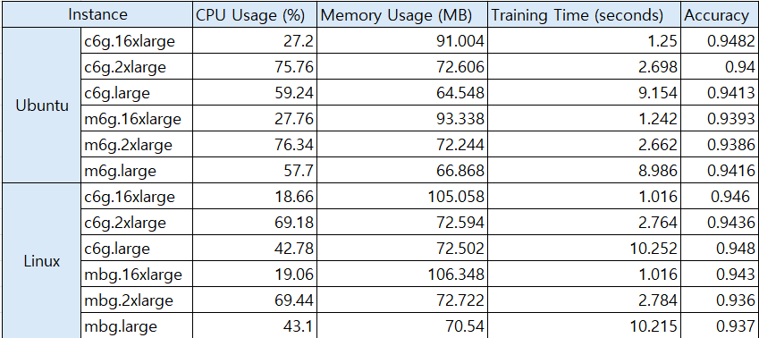
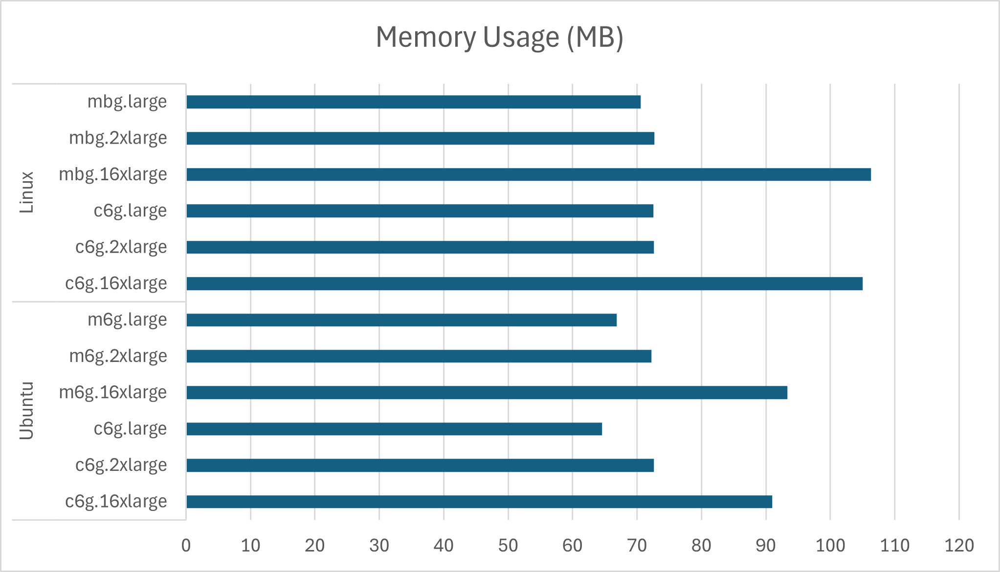
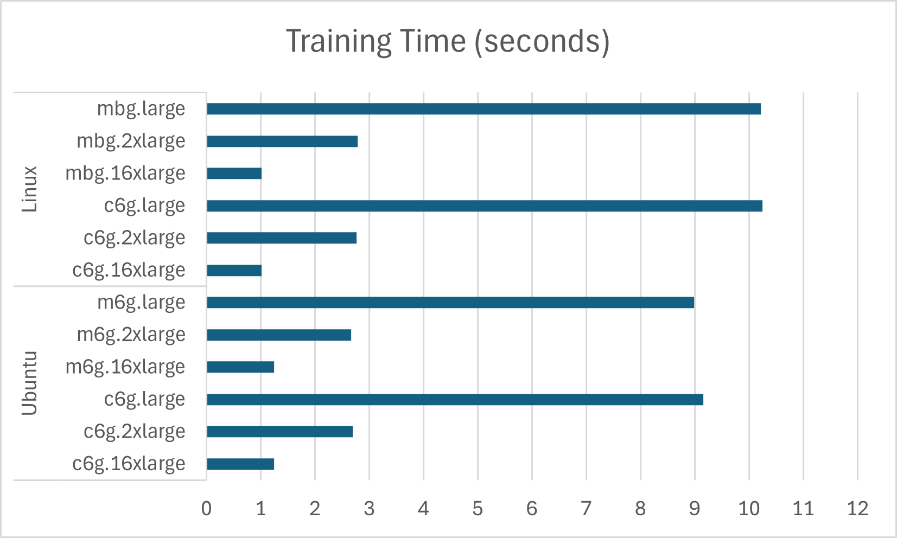

# aws 인스턴스 성능비교

```python
from sklearn.ensemble import RandomForestClassifier
from sklearn.datasets import make_classification
from sklearn.model_selection import train_test_split
import time
import psutil

# 성능 측정 시작
start_time = time.time()

# CPU 및 메모리 사용량 측정 시작
cpu_usage_start = psutil.cpu_percent(interval=None)
memory_usage_start = psutil.Process().memory_info().rss / (1024 * 1024)  # MB

# 데이터 생성 (n_samples=10000으로 줄임, n_features=30)
X, y = make_classification(n_samples=10000, n_features=30, n_informative=25, n_classes=2)
X_train, X_test, y_train, y_test = train_test_split(X, y, test_size=0.2)

# RandomForest 모델 생성 (트리 개수 증가, 병렬 처리 활성화)
model = RandomForestClassifier(n_estimators=500, max_depth=30, n_jobs=-1)  # n_jobs=-1로 모든 CPU 코어 사용

# 모델 학습
model.fit(X_train, y_train)

# 성능 측정 종료
end_time = time.time()
cpu_usage_end = psutil.cpu_percent(interval=None)
memory_usage_end = psutil.Process().memory_info().rss / (1024 * 1024)  # MB

# 결과 출력
print(f"Model training time: {end_time - start_time:.2f} seconds")
print(f"CPU usage: {cpu_usage_end - cpu_usage_start:.2f}%")
print(f"Memory usage: {memory_usage_end - memor인스턴
```

위 코드는 **랜덤 포레스트 모델**을 사용하여 학습을 수행한 뒤, **모델 훈련 성능**과 **자원 사용량**을 측정하는 코드입니다

특히 병렬 처리가 활성화된 랜덤 포레스트 모델에서 **학습 시간**, **CPU 부하** 및 **메모리 사용량**을 분석하고, **모델 정확도**까지 함께 평가할 수 있습니다.

### <인스턴스별 성능분석>



### 1. **Ubuntu 인스턴스 분석**

### **CPU Usage (%)**:


- **c6g.16xlarge**: 27.2%
- **c6g.2xlarge**: 75.76%
- **c6g.large**: 59.24%
- **m6g.16xlarge**: 27.76%
- **m6g.2xlarge**: 76.34%
- **m6g.large**: 57.7%

**분석**:

인스턴스가 클수록 CPU 사용률이 감소하는 경향을 보입니다. `c6g.16xlarge`와 `m6g.16xlarge` 인스턴스는 `c6g.2xlarge` 및 `m6g.2xlarge`에 비해 더 많은 CPU 코어를 사용하기 때문에, CPU 사용률이 낮으면서도 빠른 성능을 발휘할 수 있습니다. `c6g.large`와 `m6g.large`의 CPU 사용률은 상대적으로 높습니다.

### **Memory Usage (MB)**:



- **c6g.16xlarge**: 91.004 MB
- **c6g.2xlarge**: 72.606 MB
- **c6g.large**: 64.548 MB
- **m6g.16xlarge**: 93.338 MB
- **m6g.2xlarge**: 72.244 MB
- **m6g.large**: 66.868 MB

**분석**:

메모리 사용량은 `16xlarge` 인스턴스에서 높으며, 이는 인스턴스 크기가 커지면서 더 많은 병렬 처리 및 데이터 처리를 지원하기 때문입니다. `large` 인스턴스는 메모리 사용량이 더 적으며, `2xlarge`는 중간 정도의 메모리 사용량을 보입니다.

### **Training Time (seconds)**:



- **c6g.16xlarge**: 1.25초
- **c6g.2xlarge**: 2.698초
- **c6g.large**: 9.154초
- **m6g.16xlarge**: 1.242초
- **m6g.2xlarge**: 2.662초
- **m6g.large**: 8.986초

**분석**:

훈련 시간은 인스턴스가 커질수록 빠르게 감소하는 경향이 있습니다. `c6g.16xlarge`와 `m6g.16xlarge`는 **약 1.25초**로 매우 빠른 성능을 보이며, `large` 인스턴스는 상대적으로 **9초 이상** 걸립니다. 이는 인스턴스가 클수록 병렬 처리 성능이 크게 향상되기 때문입니다.

### **Accuracy**:

- **c6g.16xlarge**: 0.9482
- **c6g.2xlarge**: 0.94
- **c6g.large**: 0.9413
- **m6g.16xlarge**: 0.9393
- **m6g.2xlarge**: 0.9361
- **m6g.large**: 0.9416

**분석**:

모델 정확도는 인스턴스 크기와 크게 상관없이 **0.93-0.94 범위**에서 유지되고 있습니다. 즉, 인스턴스 성능이 학습 시간과 자원 사용 효율성에 영향을 미치지만, 정확도에는 큰 차이가 없습니다.

---

### 2. **Linux 인스턴스 분석**

### **CPU Usage (%)**:


- **c6g.16xlarge**: 18.66%
- **c6g.2xlarge**: 69.18%
- **c6g.large**: 42.78%
- **mbg.16xlarge**: 19.06%
- **mbg.2xlarge**: 69.44%
- **mbg.large**: 43.1%

**분석**:

Ubuntu와 마찬가지로 **큰 인스턴스일수록 CPU 사용률이 감소**하는 경향이 보입니다. 

`16xlarge` 인스턴스는 상대적으로 낮은 CPU 사용률로도 높은 성능을 유지하고 있으며, 

`large` 인스턴스는 더 높은 CPU 사용률을 보입니다.

### **Memory Usage (MB)**:


- **c6g.16xlarge**: 105.058 MB
- **c6g.2xlarge**: 72.594 MB
- **c6g.large**: 72.502 MB
- **mbg.16xlarge**: 106.348 MB
- **mbg.2xlarge**: 72.722 MB
- **mbg.large**: 70.54 MB

**분석**:

Linux에서의 메모리 사용량도 Ubuntu와 유사한 경향을 보이며, 큰 인스턴스일수록 더 많은 메모리를 사용하고 있습니다. 

특히 `16xlarge` 인스턴스는 약 **105-106 MB**의 메모리를 사용하고 있으며, 

`large` 인스턴스는 상대적으로 적은 메모리를 사용합니다.

### **Training Time (seconds)**:


- **c6g.16xlarge**: 1.016초
- **c6g.2xlarge**: 2.764초
- **c6g.large**: 10.252초
- **mbg.16xlarge**: 1.016초
- **mbg.2xlarge**: 2.784초
- **mbg.large**: 10.215초

**분석**:

Linux에서도 큰 인스턴스일수록 훈련 시간이 **1초 내외**로 매우 짧습니다. 

반면 `large` 인스턴스는 훈련 시간이 **10초 이상** 걸립니다. 

이는 큰 인스턴스의 **병렬 처리 성능**이 더욱 뛰어남을 보여줍니다.

### **Accuracy**:

- **c6g.16xlarge**: 0.946
- **c6g.2xlarge**: 0.9436
- **c6g.large**: 0.948
- **mbg.16xlarge**: 0.943
- **mbg.2xlarge**: 0.936
- **mbg.large**: 0.937

**분석**:

Linux에서의 모델 정확도는 0.93-0.95 사이에서 유지되고 있습니다. 

인스턴스 크기에 따라 정확도는 큰 차이를 보이지 않으며, 대체로 안정적으로 유지되고 있습니다.

## <요약>

1. **훈련 시간**:
    
    인스턴스가 커질수록 훈련 시간이 극적으로 감소합니다. 이는 인스턴스의 병렬 처리 능력 덕분으로, 특히 **대규모 데이터셋**이나 **복잡한 모델 학습**에서 큰 장점이 됩니다.
    
2. **CPU 사용률**:
    
    인스턴스가 클수록 **CPU 사용률이 낮아지지만**, 더 적은 자원으로 높은 성능을 발휘할 수 있습니다. 큰 인스턴스는 **병렬 처리에 최적화**되어 개별 CPU 코어의 부하를 줄입니다.
    
3. **메모리 사용량**:
    
    `16xlarge` 인스턴스는 메모리 사용량이 더 많아지지만, 이는 **병렬 처리 성능을 높여 더 많은 데이터를 처리**할 수 있게 하는 중요한 요소입니다.
    
4. **모델 정확도**:
    
    인스턴스 크기와 관계없이 **모델 정확도는 안정적으로 높은 수준**을 유지합니다. 
    
    따라서 인스턴스 크기는 주로 **처리 속도와 자원 효율성**에 영향을 미치며, 
    
    모델의 성능 개선에는 하이퍼파라미터 튜닝이나 데이터 개선이 더 중요한 역할을 합니다.
    

## <세부분석>

### 1. **c6g.large vs c6g.2xlarge vs c6g.16xlarge 분석**

### **Model training time (seconds)**:

- `c6g.large`: 평균 10.252초
- `c6g.2xlarge`: 평균 2.764초
- `c6g.16xlarge`: 평균 1.016초

**분석**:

인스턴스 크기가 커질수록 모델 훈련 시간이 대폭 줄어듭니다. 

이는 인스턴스가 더 많은 **vCPU**와 **병렬 처리 능력**을 갖추고 있어 작업 속도가 크게 향상된다는 것을 보여줍니다. 

특히 `c6g.16xlarge`는 `c6g.large`보다 **10배 이상 빠른** 성능을 보입니다. 

이는 특히 대규모 데이터 처리나 모델 학습에서 매우 유용합니다.

### **CPU usage (%)**:

- `c6g.large`: 평균 42.78%
- `c6g.2xlarge`: 평균 69.18%
- `c6g.16xlarge`: 평균 18.66%

**분석**:

인스턴스 크기가 커질수록 **CPU 사용률은 감소**하는 경향이 있습니다. `c6g.16xlarge`는 낮은 CPU 사용률로도 높은 성능을 발휘합니다. 이는 더 많은 **CPU 코어를 병렬로 활용**하여 개별 코어의 부하가 적어지기 때문입니다. 반면 `c6g.2xlarge`는 더 높은 CPU 사용률을 보이는데, 이는 더 많은 데이터를 처리하기 위해 더 많은 CPU 자원을 활용하고 있다는 의미입니다.

### **Memory usage (MB)**:

- `c6g.large`: 평균 72.502 MB
- `c6g.2xlarge`: 평균 72.594 MB
- `c6g.16xlarge`: 평균 105.058 MB

**분석**:

`c6g.large`와 `c6g.2xlarge`의 메모리 사용량은 큰 차이가 없지만, `c6g.16xlarge`에서는 메모리 사용량이 **상당히 증가**합니다. 이는 **병렬 처리**를 통해 더 많은 데이터를 동시에 처리할 수 있기 때문에 메모리 사용이 늘어난 것으로 해석됩니다.

### **Model accuracy**:

- `c6g.large`: 평균 0.9476
- `c6g.2xlarge`: 평균 0.9436
- `c6g.16xlarge`: 평균 0.9463

**분석**:

인스턴스 크기와 관계없이 **모델 정확도는 큰 차이가 없습니다**. 모델 정확도는 인스턴스의 성능보다는 **데이터 품질**이나 **모델의 하이퍼파라미터 설정**에 더 큰 영향을 받습니다. 따라서 인스턴스 크기를 키우는 것은 주로 **모델 학습 시간**과 **처리 효율성**에 영향을 미칩니다.

---

### 2. **mbg.large vs mbg.2xlarge vs mbg.16xlarge 분석**

### **Model training time (seconds)**:

- `mbg.large`: 평균 10.252초
- `mbg.2xlarge`: 평균 2.784초
- `mbg.16xlarge`: 평균 1.016초

**분석**:

`mbg` 시리즈도 `c6g`와 유사하게 인스턴스 크기가 커질수록 **훈련 시간이 급격히 감소**합니다. `mbg.16xlarge`는 `mbg.large`보다 **10배 이상 빠릅니다**. 대규모 데이터나 복잡한 모델 학습에서는 큰 인스턴스를 선택하는 것이 시간 효율 측면에서 유리합니다.

### **CPU usage (%)**:

- `mbg.large`: 평균 43.10%
- `mbg.2xlarge`: 평균 69.44%
- `mbg.16xlarge`: 평균 19.06%

**분석**:

`mbg` 시리즈도 `c6g` 시리즈와 마찬가지로, 인스턴스가 커질수록 **CPU 사용률이 감소**합니다. `mbg.16xlarge`는 낮은 CPU 사용률로도 **병렬 처리 효율성**을 극대화하여 높은 성능을 보입니다. 반면 `mbg.2xlarge`는 높은 CPU 사용률을 보이며, 이는 더 많은 데이터를 처리하기 위해 CPU 자원을 적극적으로 활용하는 것으로 해석됩니다.

### **Memory usage (MB)**:

- `mbg.large`: 평균 72.722 MB
- `mbg.2xlarge`: 평균 106.348 MB
- `mbg.16xlarge`: 평균 105.058 MB

**분석**:

`mbg.2xlarge`와 `mbg.16xlarge`는 메모리 사용량이 크게 증가합니다. 이는 더 큰 인스턴스가 **동시에 더 많은 데이터를 처리할 수 있는 능력**이 향상되었기 때문에, 추가적인 메모리 사용이 요구되는 것으로 보입니다.

### **Model accuracy**:

- `mbg.large`: 평균 0.9476
- `mbg.2xlarge`: 평균 0.9362
- `mbg.16xlarge`: 평균 0.9426

**분석**:

모델 정확도는 인스턴스 크기에 크게 영향을 받지 않습니다. 

`mbg` 시리즈 역시 인스턴스 크기가 커져도 **정확도가 일정하게 유지**되는 경향이 있으며, 

이는 모델의 하이퍼파라미터나 데이터 특성이 성능에 더 큰 영향을 준다는 것을 의미합니다.