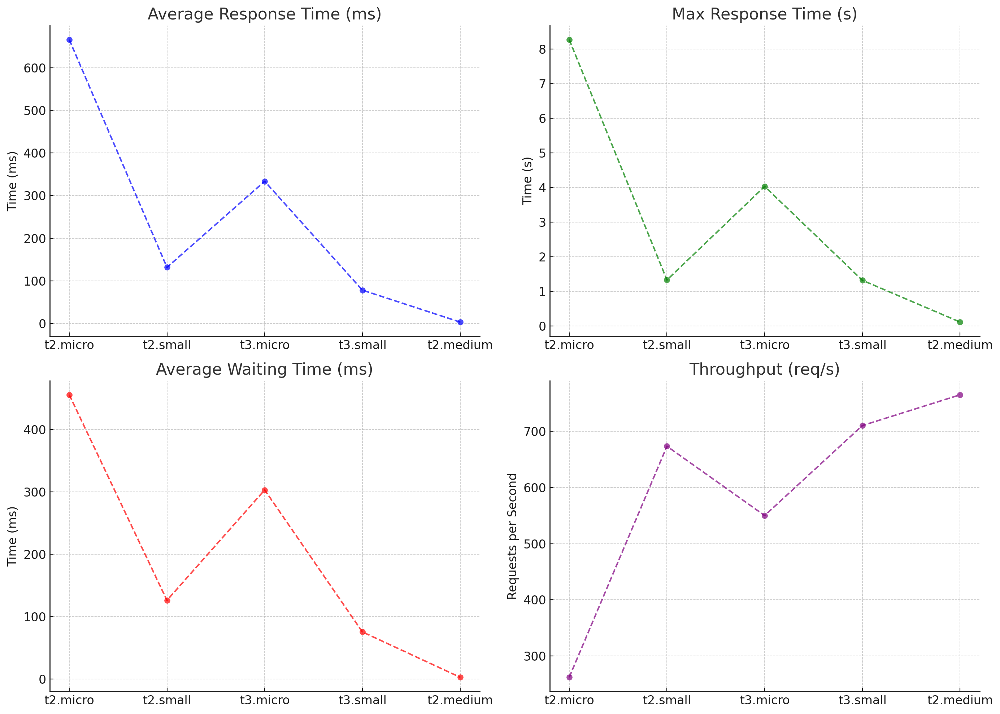

### 개요
신한투자증권에서는 IPO 상장 시 트래픽이 몰려 대비를 해야 하는 것이 주요 쟁점이다.<br>
이 점에 주목하여 EC2 종류에 따른 부하 테스트를 진행하여 해당 서버의 시간당 처리량과 처리 시간을 알고자 한다.

### 실습 과정
1. 성능 테스트 도구 중 K6를 선택
2. 부하 테스트 종류 중 spike test 선택 <br>
   -> spike test란, 특정 시간 동안 트래픽을 급격히 증가시키고, 그 후 급격히 감소시키는 테스트 방식
3. 실험할 EC2 선택
4. spike test 진행
5. 결과 분석

### EC2 종류
| Instance Type | vCPU | Memory (GB) |
| ------------- | ---- | ----------- |
| t2.micro      | 1    | 1           |
| t2.small      | 1    | 2           |
| t3.micro      | 2    | 1           |
| t3.small      | 2    | 2           |
| t2.medium     | 2    | 4           |

### Spike Test

```javascript
import http from "k6/http";
import { sleep, check } from 'k6';

export let options = {
    insecureSkipTLSVerify: true,
    noConnectionReuse: false,
    stages: [
        { duration: '20s', target: 100 },
        { duration: '30s', target: 2000 },
        { duration: '20s', target: 100 },      
    ],
};

export default function () {
    const res = http.get('http://3.37.30.99:8080');
    check(res, { 'status was 200': (r) => r.status == 200 });
    sleep(1);
};
```
- 원초기 사용자 수 (100명): 100명의 가상 사용자로 시작해 서버가 적은 트래픽에서 어떻게 반응하는지 확인합니다.
- 급격한 트래픽 증가 (2000명): 20초 후 2000명으로 급증해 서버가 많은 요청을 어떻게 처리하는지 평가합니다.
- 트래픽 감소 (100명): 30초 동안 2000명을 유지한 후 다시 100명으로 감소하며, 서버의 복구 능력을 테스트합니다.

### 결과 분석

| **지표 (vCPU, 메모리-GiB)** | **t2.micro (1, 1)** | **t2.small (1, 2)** | **t3.micro (2, 1)** | **t3.small (2, 2)** | **t2.medium (2, 4)** |
| --- | --- | --- | --- | --- | --- |
| **총 요청 수** | 19,190 | 47,804 | 39,131 | 50,432 | 54,290 |
| **응답 시간 (평균)** | 666.37ms | 131.57ms | 333.68ms | 78.08ms | 3.1ms |
| **최대 응답 시간** | 8.27s | 1.33s | 4.03s | 1.32s | 114.46ms |
| **대기 시간 (평균)** | 455.7ms | 126.26ms | 303.22ms | 75.66ms | 2.99ms |
| **블로킹 시간 (평균)** | 168.83ms | 728.38µs | 58.72ms | 528.59µs | 55.44µs |
| **연결 시간 (평균)** | 153.57ms | 687.89µs | 49.86ms | 496.49µs | 45.32µs |
| **처리량 (req/s)** | 261.99 req/s | 673.47 req/s | 549.99 req/s | 710.32 req/s | 765.07 req/s |
| **iteration_duration (평균)** | 2.93s | 1.14s | 1.4s | 1.08s | 1s |
<br>



### 테스트 실행 시 한계 
- EC2 중단시 테스트 불가
  -> 테스트의 목표는 사용자가 요청을 얼마나 많이 할 경우 서버가 다운되는지를 파악하는 것이었으나, <br>
     요청이 많아지면 EC2 인스턴스가 다운되고 재부팅 후에도 테스트가 계속되지 않는 문제가 발생하였다.

### 향후 계획
K6를 활용하여 시나리오 테스트를 진행할 예정이다.
이 테스트는 API를 사용해 사용자가 로그인 후 주식을 조회하고, 매수하며, 로그아웃하는 과정을 시뮬레이션한다.
이를 통해 보다 유의미한 부하 테스트 결과를 얻을 수 있을 것이다. <br>
또한, 서버 다운 상황을 대비하여 오토스케일링을 설정할 계획이다. 
Spike Test를 진행하면서 사용자가 급격히 몰리는 경우를 가정해 EC2 인스턴스 수를 자동으로 증가시켜 서버가 다운되지 않도록 하여 안정성을 확보할 수 있을 것이다. 

[시나리오 테스트를 위한 예시 코드]
```javascript
// 로그인 시뮬레이션 함수
function login() {
    let res = http.post('https://example.com/api/login', JSON.stringify({
        username: 'test_user',
        password: 'test_pass',
    }), {
        headers: { 'Content-Type': 'application/json' },
    });

    check(res, {
        '로그인 성공': (r) => r.status === 200,
    });

    return res.json().cookies.session_id; // 세션 ID 반환
}

// 주식 조회 시뮬레이션 함수
function viewStock(session_id) {
    let res = http.get('https://example.com/api/stock/search?query=Samsung', {
        headers: { 'Cookie': `session_id=${session_id}` },
    });

    check(res, {
        '주식 조회 성공': (r) => r.status === 200,
    });
}

// 주식 매수 시뮬레이션 함수
function buyStock(session_id) {
    let res = http.post('https://example.com/api/stock/buy', JSON.stringify({
        stock_id: '005930', // 삼성 주식 예시
        quantity: 10,       // 10주 매수
    }), {
        headers: {
            'Content-Type': 'application/json',
            'Cookie': `session_id=${session_id}`,
        },
    });

    check(res, {
        '주식 매수 성공': (r) => r.status === 200,
    });
}

// 로그아웃 시뮬레이션 함수
function logout(session_id) {
    let res = http.post('https://example.com/api/logout', null, {
        headers: { 'Cookie': `session_id=${session_id}` },
    });

    check(res, {
        '로그아웃 성공': (r) => r.status === 200,
    });
}

// 각 가상 사용자(VU)가 실행할 기본 함수
export default function () {
    // 1. 로그인
    let session_id = login();

    // 2. 주식 조회
    viewStock(session_id);

    // 3. 주식 매수
    buyStock(session_id);

    // 4. 로그아웃
    logout(session_id);

    sleep(1); // 1초 대기
}

```
