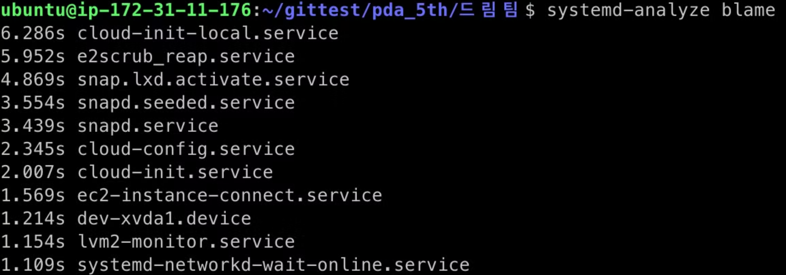

# 실험 개요

1. 5개의 아이유 gif를 blob파일로 변환 후 저장한다.
2. 저장된 blob파일을 다시 gif로 변환한다.
<div align="center">


# 👇🏻👆🏻


```python
                4749463839615203a802f7ff0097b9cfcddcfd33668ad9acb54a446effffffd193925b1a2b8aaabbefbacdb27
                06facb9d7d8b7d0d890d6acccdd463366d072a26c4c6cf1b4b78b95b5b68c8e77aabb000011904d516a739433
                55882244770000224554896688aad397adb56db46699aa447799450f46da64751122665577992233772244887
                799bbffccff946a705588aaf02262cb8478b494b169889944669970444dd9afef6c3149904c92558899eeffff
                220033110033ffbbff94304c6a2b6fd172c60000008f526adaccdb44668890718effddee000033b451b292071
                e110022ffddfff199ee113366112255225588221144ddeeffb1728db594cf00225511447099ccd72211330011
                55113377b0516ab7abbb8e2e8eeeccddee95dcffccdd331144ffeeff7799aa714c8b6a76aa908a94bbddee222
                2553322556699bb332244712b89cceeff4e0a69534455ac50531111443344779470ad33448872677cffaaffbb
                ddff442255001144bdccee0f1166333366442244361133fdccbaddffffad52955577aa553355f396ae443355b
                46855ffccee223366000044eeaa98f288919550aa375577eeaaff312333ffcccc2f000aaacceedcaa98225577
                ecbbffeecccc110044447788222266111155112277eeaaeb7788aa2200226b0c73333355360033edddeeeacce
                e9696ccb8baee22224454
```


</div>
<div align="center">

</div>
<br>
  - AMI: Ubuntu 22.04 LTS
<br>
  - 아키텍처: x86/ARM
<br>
  - 테스트 환경: AWS i-family, d-family, c-family, r-family, m-family, t2-family, t3-family 인스턴스 사용


- - -

<br>

## I : 높은I/O (ssd)


| **인스턴스** | **vCPU** | **메모리(GiB)** | **인스턴스 스토리지(GB)** | **네트워킹 성능(Gbps)** | **실행 시간** | **평균 CPU 사용량** | **평균 메모리 사용량** |
| --- | --- | --- | --- | --- | --- | --- | --- |
| i3.large | 2 | 15.25 | 1 x 475 NVMe SSD | 최대 10 | 9693.98 ms | 49.50% | 4.70% |
| i3.xlarge | 4 | 30.5 | 1 x 950 NVMe SSD | 최대 10 | 11434.90 ms | 21.54% | 2.64% |
| i3.2xlarge | 8 | 61 | 1 x 1,900 NVMe SSD | 최대 10 | 9736.63 ms | 12.32% | 1.96% |


## d : 높은I/O (hdd)


| **인스턴스** | **vCPU** | **메모리(GiB)** | **인스턴스 스토리지(GB)** | **네트워크 성능** | **실행 시간** | **평균 CPU 사용량** | **평균 메모리 사용량** |
| --- | --- | --- | --- | --- | --- | --- | --- |
| d2.xlarge | 4 | 30.5 | 3 x 2000 HDD | 중간 | 10086.27 ms | 23.88% | 2.64% |
| d2.2xlarge | 8 | 61 | 6 x 2000 HDD | 높음 | 9761.97 ms | 12.34% | 1.80% |

## C : 컴퓨팅 


| **인스턴스** | **vCPU** | **메모리(GiB)** | **스토리지** | **전용 EBS 대역폭(Mbps)** | **네트워크 성능** | **실행 시간** | **평균 CPU 사용량** | **평균 메모리 사용량** |
| --- | --- | --- | --- | --- | --- | --- | --- | --- |
| c4.large | 2 | 3.75 | EBS 전용 | 500 | 중간 | 7299.39 ms | 49.32% | 14.76% |
| c4.xlarge | 4 | 7.5 | EBS 전용 | 750 | 높음 | 7768.09 ms | 23.84% | 7.66% |
| c4.2xlarge | 8 | 15 | EBS 전용 | 1,000 | 높음 | 7781.95 ms | 11.94% | 4.12% |

## R : 메모리 최적화


| **인스턴스** | **vCPU** | **메모리(GiB)** | **인스턴스 스토리지(GB)** | **네트워킹 성능(Gbps)** | **EBS 대역폭(Mbps)** | **실행 시간** | **평균 CPU 사용량** | **평균 메모리 사용량** |
| --- | --- | --- | --- | --- | --- | --- | --- | --- |
| r5.large | 2 | 16 | EBS 전용 | 최대 10 | 최대 4,750 | 8923.37 ms | 49.22% | 4.24% |
| r5.xlarge | 4 | 32 | EBS 전용 | 최대 10 | 최대 4,750 | 8498.46 ms | 24.56% | 2.90% |
| r5.2xlarge | 8 | 64 | EBS 전용 | 최대 10 | 최대 4,750 | 8362.76 ms | 12.26% | 1.64% |


## m : 범용


| **인스턴스** | **vCPU** | **메모리(GiB)** | **스토리지** | **전용 EBS 대역폭(Mbps)** | **네트워크 성능** | **실행 시간** | **평균 CPU 사용량** | **평균 메모리 사용량** |
| --- | --- | --- | --- | --- | --- | --- | --- | --- |
| m4.large | 2 | 8 | EBS 전용 | 450 | 중간 | 9075.25 ms | 49.10% | 7.58% |
| m4.xlarge | 4 | 16 | EBS 전용 | 750 | 높음 | 8787.36 ms | 24.62% | 3.92% |
| m4.2xlarge | 8 | 32 | EBS 전용 | 1,000 | 높음 | 8668.05 ms | 12.38% | 2.32% |

## t3 : 성능 순간 확장


| **인스턴스** | **vCPU** | **시간당 CPU 크레딧** | **메모리(GiB)** | **스토리지** | **네트워크 성능(Gbps)** | **실행 시간** | **평균 CPU 사용량** | **평균 메모리 사용량** |
| --- | --- | --- | --- | --- | --- | --- | --- | --- |
| t3.large | 2 | 36 | 8 | EBS 전용 | 최대 5 | 10858.74 ms | 47.82% | 7.5% |
| t3.xlarge | 4 | 96 | 16 | EBS 전용 | 최대 5 | 10063.79 ms | 22.70% | 3.84% |
| t3.2xlarge | 8 | 192 | 32 | EBS 전용 | 최대 5 | 9133.77 ms | 11.88% | 2.42% |

## t2(x86) : 


| **인스턴스** | **vCPU** | **시간당 CPU 크레딧** | **메모리(GiB)** | **스토리지** | **네트워크 성능** | **실행 시간** | **평균 CPU 사용량** | **평균 메모리 사용량** |
| --- | --- | --- | --- | --- | --- | --- | --- | --- |
| t2.large | 2 | 36 | 8 | EBS 전용 | 낮음에서 중간 | 8506.82 ms | 47.54% | 7.18% |
| t2.xlarge | 4 | 54 | 16 | EBS 전용 | 중간 | 8124.47 ms | 25.46% | 3.72% |
| t2.2xlarge | 8 | 81 | 32 | EBS 전용 | 중간 | 8197.03 ms | 23.74% | 2.60% |


## t2(ARM) :


| **인스턴스** | **vCPU** | **시간당 CPU 크레딧** | **메모리(GiB)** | **스토리지** | **네트워크 성능** | **실행 시간** | **평균 CPU 사용량** | **평균 메모리 사용량** |
| --- | --- | --- | --- | --- | --- | --- | --- | --- |
| t4g.large | 2 | 8 | 30% | 36 | 최대 5 | 9133.60 ms | 47.78% | 6.38% |
| t4g.xlarge | 4 | 16 | 40% | 96 | 최대 5 | 9012.53 ms | 24.64% | 3.92% |
| t4g.2xlarge | 8 | 32 | 40% | 192 | 최대 5 | 8450.15 ms | 12.40% | 2.52% |

---


---


# 📑 분석 1


### 1. **처음 실행 시 초기화 오버헤드**:

- EC2 인스턴스를 생성한 직후에는 시스템이 초기화되고 필요한 자원을 준비하는 시간이 필요할 수 있습니다. 이로 인해 초기 실행 시간은 길어질 수 있습니다.

### 2. **캐시와 메모리 관리**:

- 인스턴스가 실행된 후 일정 시간이 지나면 운영 체제가 자주 사용하는 데이터나 코드의 캐시를 유지하여 성능을 향상시킬 수 있습니다. 이로 인해 코드 실행 시간이 줄어들 수 있습니다.

---
# 📑 분석 2
- I 시리즈(높은 I/O), R 시리즈(메모리 최적화), C 시리즈(높은 컴퓨팅)중 C 시리즈가 더 빠른 이유: 해당 작업이 단순한 파일 I/O가 아니라 GIF → Blob → GIF 변환 과정에서 연산 작업이 포함되기 때문에, 높은 컴퓨팅 성능을 제공하는 C 시리즈가 더 적합했을 것으로 보입니다.
- 의문: I 시리즈가 D 시리즈보다 느리게 동작하는 이유에 대해 명확히 알 수 없습니다.
---

# 📑 분석 3

| **인스턴스** | **vCPU*** | **메모리(GiB)** | **스토리지** | **전용 EBS 대역폭(Mbps)** | **네트워크 성능***** | **실행 시간** | 평균 CPU 사용량 |
| --- | --- | --- | --- | --- | --- | --- | --- |
| m4.large | 2 | 8 | EBS 전용 | 450 | 중간 | 9075.25 ms | 49.10% |
| m4.xlarge | 4 | 16 | EBS 전용 | 750 | 높음 | 8787.36 ms | 24.62% |
- xlarge가 large보다 성능이 두 배정도 좋은데 왜 cpu 사용량을 1/2로 줄여서 프로그램을 실행할까? 비슷하게 cpu를 50%정도 사용하면 실행시간이 1/2로 줄어들지 않을까?
    - **CPU는 가능한 최소한의 리소스를 사용하여 작업을 수행하며, 이로 인해 CPU 사용량이 낮아질 수 있습니다.**
    - **CPU는 필요한 만큼만 리소스를 사용하고, 나머지는 대기 상태로 유지하여 시스템의 전반적인 성능과 안정성을 높이는 것이 중요**

